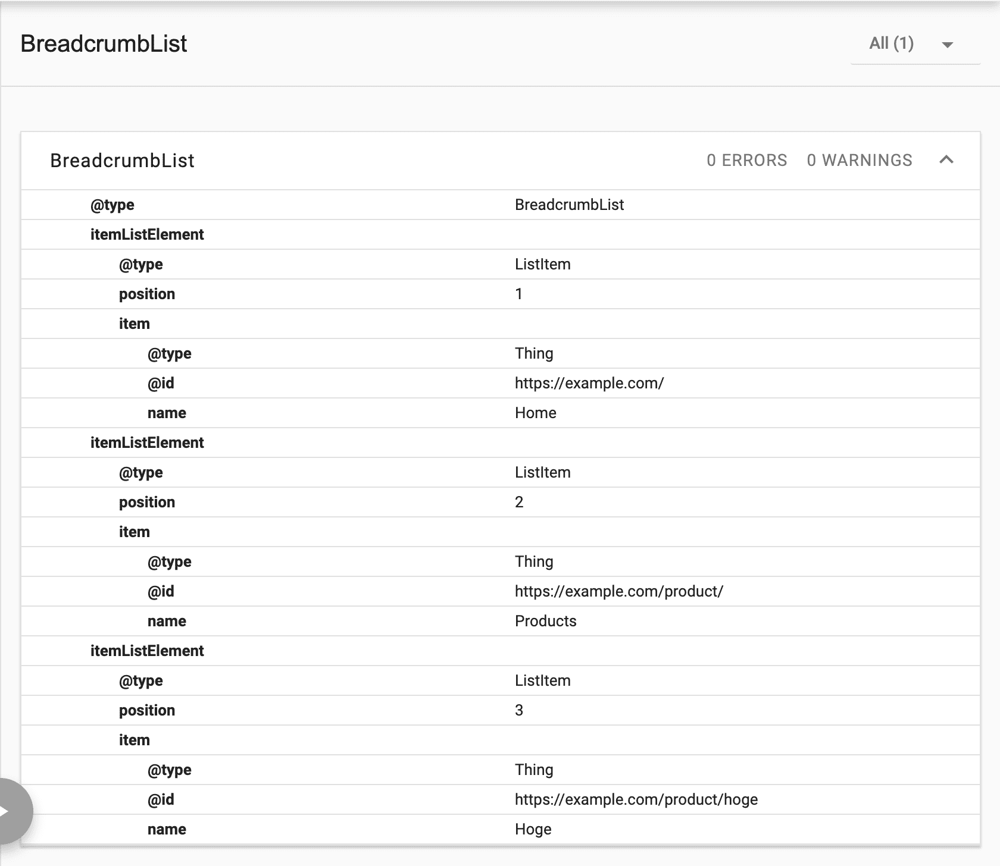

# react-breadcrumbs-jsonld

[](https://badge.fury.io/js/react-breadcrumbs-jsonld)
[](https://opensource.org/licenses/MIT)

## Overview

Dynamically generates JSON-LD structured for breadcrumbs in React.

## Installation

You can install this library using npm:

```shell
npm install react-breadcrumbs-jsonld
```

## Usage

- `url` must be an absolute path.
  - Must begin with either `http` or `https`.
- URLs must be recursively nested.

### Example

```tsx
import { BreadcrumbSchema, BreadcrumbItem } from "react-breadcrumbs-jsonld";

function App() {
  const breadcrumbs: BreadcrumbItem[] = [
    { url: "https://example.com/", name: "Home" },
    { url: "https://example.com/product/", name: "Products" },
    { url: "https://example.com/product/hoge", name: "Hoge" },
  ];

  return (
    <>
      <BreadcrumbSchema breadcrumbs={breadcrumbs} />
    </>
  );
}
```

### Output

```html
<script type="application/ld+json">
  {
    "@context": "https://schema.org",
    "@type": "BreadcrumbList",
    "itemListElement": [
      {
        "@type": "ListItem",
        "position": 1,
        "item": {
          "@id": "https://example.com/",
          "name": "Home"
        }
      },
      {
        "@type": "ListItem",
        "position": 2,
        "item": {
          "@id": "https://example.com/product/",
          "name": "Products"
        }
      },
      {
        "@type": "ListItem",
        "position": 3,
        "item": {
          "@id": "https://example.com/product/hoge",
          "name": "Hoge"
        }
      }
    ]
  }
</script>
```

### Schema.org Test Result



## Link

- [Breadcrumb (BreadcrumbList) structured data](https://developers.google.com/search/docs/appearance/structured-data/breadcrumb)
- [Schema.org](http://schema.org/)
- [schema-dts](https://github.com/google/schema-dts)

## License

This project is licensed under the MIT License - see the [LICENSE](LICENSE) file for details.
